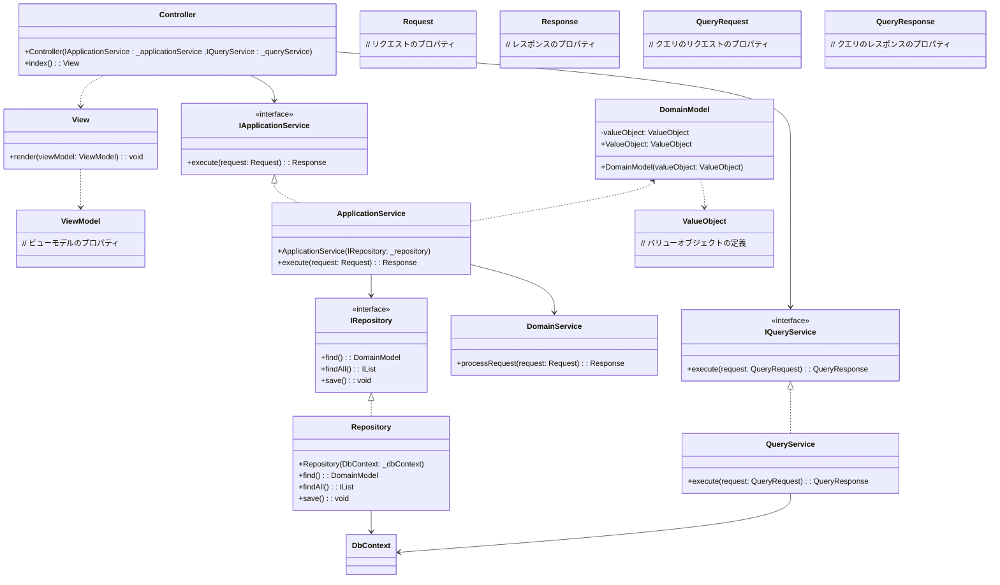

# Merino

|・[概要](#概要)<br>・[アーキテクチャ](#アーキテクチャ)<br>・[WEBアプリケーション初期化](#WEBアプリケーション初期化)<br>・[依存注入](#依存注入)<br>・[ログ](#ログ)<br>・[例外](#例外)<br>・[セッション管理](#セッション管理)<br>|
|:-|

## 概要
基底のフレームワークにはASP.NET Core MVCの利用を前提にする。
Webアプリケーション開発における基本的な機能を提供し、アーキテクチャはプロジェクトごとに選定する。
DB接続に関してはEntityFrameworkを採用し、
</br></br>

## アーキテクチャ
ASP.NET MVCにおいてのMVCモデルの考えかたをベースに、
M(Model)以降のアーキテクチャ構成についてはプロジェクトの規模感、参画メンバー
等を考慮して選定する必要がある。
</br>

#### ・3層レイヤー + トランザクションスクリプト


#### ・オニオンアーキテクチャ + DDD



## Webアプリケーションの初期化

1. [設定ファイル](/Document/Setting.md)の準備

2. WEBプロジェクトの参照に追加
3. Program.csを修正

```C#:Program.cs
using Merino;

//アプリケーション初期化
WebApplicationBuilder builder = BootStrap.BuildWebApplication(args);

WebApplication app = BootStrap.CreateWebApplication(builder);

BootStrap.RunWebApplication(app);

```

## 依存注入
インジェクション拡張ライブラリのScrutorを使する。</br>
[Scrutor github](https://github.com/khellang/Scrutor/tree/master)</br>
[解説](https://andrewlock.net/using-scrutor-to-automatically-register-your-services-with-the-asp-net-core-di-container/#registering-services-which-match-a-standard-naming-convention)

設定ファイルに記載されたアセンブリ内のクラス名から自動的に判断し、</br>
ScopedでInjectionを行う。</br>
文字列に一致するクラスを検索し、そのクラスとインターフェースを登録する。</br>
すでに登録済みのインターフェースがヒットした場合、実装クラスを置き換える。
実装が2種類存在する場合は、[設定ファイル](/Document/Setting.md)の</br>
ExactMatchNamesに記載された実装クラスで登録される。

```C#:Program.cs
foreach (string cond in conditions)　//検索文字列でループ
{
    builder.Services.Scan(scan =>
    scan.FromAssemblyDependencies(assembly) //対象アセンブリ
    .AddClasses(classes => classes.Where(type =>
    type.Assembly == assembly && type.Name.EndsWith(cond))) //アセンブリ内のクラスを検索
    .UsingRegistrationStrategy(Scrutor.RegistrationStrategy.Replace(Scrutor.ReplacementBehavior.ServiceType)) //登録済みの場合の仕様
    .AsImplementedInterfaces() //インターフェースと一緒に登録
    .WithScopedLifetime()); //ライフサイクル
}

```


## ログ
Nolgを使用


## Entity Framework

1-1.Contextを配置するプロジェクトにNuGetよりEntityFramework.Core、プロパイダごとのパッケージをインストール</br>
1-2.スタートアッププロジェクトにEntityFramework.Toolをインストール</br>
2.dbContextを継承したクラスを作成</br>
3.設定ファイルのEntityFrameworkの項目を記載</br>
4.マイグレーションの実行</br>

#### ・マイグレーションの実行

```
// マイグレーションファイル作成
cd [スタートアッププロジェクト]

dotnet ef migrations add [マイグレーションファイル名] --project [Contextを含むプロジェクト] --startup-project [実行プロジェクト] --context [実行するContext]

// DBを更新する
dotnet ef database update --context [実行するContext]

// データベースを削除する
dotnet ef database drop -f -v --context [実行するContext]
```

```
>dotnet ef migrations add Initial --project ..\WebMvcSampleLibrary\WebMvcSampleLibrary.csproj --startup-project .\WebMvcSample.csproj --context PostgresContext
Build started...
Build succeeded.
Done. To undo this action, use 'ef migrations remove'

>dotnet ef database update --context PostgresContext
Build started...
Build succeeded.
Applying migration '20240119070959_Initial'.
Done.
```

## 例外

## メッセージ

## セッション管理

## キャッシュ管理

## 利用ライブラリ